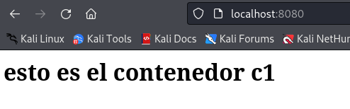

# Almacenamiento

## Ejercicio entregar

### Creación y uso de volúmenes
1. Crear los siguientes volúmenes con la orden docker volume: volumen_datos y volumen_web.


2. Arrancar un contenedor llamado c1 sobre la imagen php:7.4-apache que monte el volumen_web en la ruta /var/www/html y que sea accesible en el puerto 8080.


3. Arrancar un contenedor llamado c2 sobre la imagen mariadb que monte el volumen_datos en la ruta /var/lib/mysql y cuya contraseña de root sea admin.


4. Intenta borrar el volumen volumen_datos, para ello tendrás que parar y borrar el contenedor c2 y tras ello borrar el volumen.


5. Copia o crea un fichero index.html al contenedor c1, accede al contenedor y comprueba que se está visualizando.

He ejecutado el siguiente comando para crear el **index.html**

```bash
docker exec c1 /bin/bash -c "echo '<h1> esto es el contenedor c1</h1>' > index.html"
```



6. Borra el contenedor c1 y crea un contenedor c3 con las mismas características que c1 pero sirviendo en el puerto 8081.


 
### Bind mount para compartir datos
1. Crea una carpeta llamada saludo y dentro de ella crea un fichero llamado index.html con el siguiente contenido (Deberás sustituir ese XXXXXx por tu nombre.):

```html
<h1>HOLA SOY XXXXXX</h1>
```


2. Una vez hecho esto arrancar dos contenedores basados en la imagen php:7.4-apache que hagan un bind mount de la carpeta saludo en la carpeta /var/www/html del contenedor. Uno de ellos vamos a acceder con el puerto 8181 y el otro con el 8282. Y su nombres serán c1 y c2.


3. Modifica el contenido del fichero ~/saludo/index.html.


4. Comprueba que puedes seguir accediendo a los contenedores, sin necesidad de reiniciarlos.


