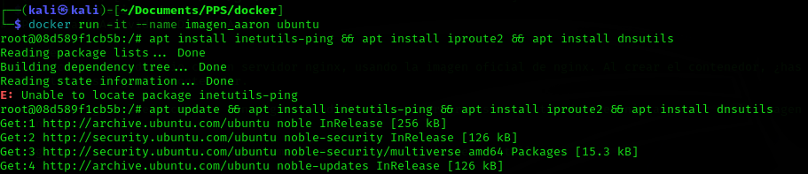
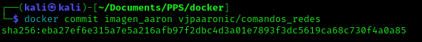
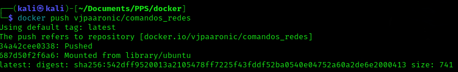
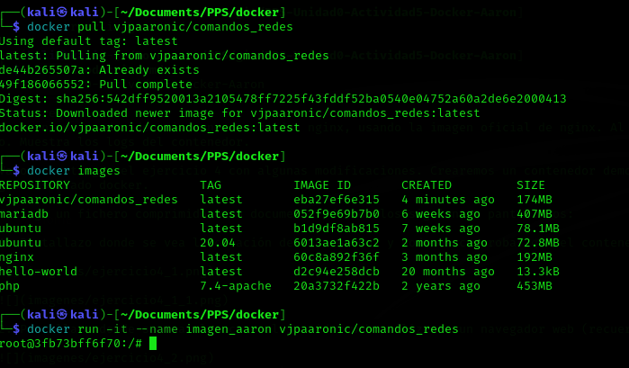

# Creación de imágenes

## Ejercicio entregar

Para la realización de estos ejercicios es necesario tener una cuenta en Docker Hub.

Entrega uno de estos dos ejercicios (si estás muy aburrido puedes entregar los dos):

1. Arranca un contenedor desde una imagen base debian o ubuntu.

He creado el contenedor con una imagen ubuntu con el siguiente comando.

```bash
docker run -it --name imagen_aaron ubuntu
```

2. Instala los paquetes inetutils-ping, iproute2 y dnsutils con distintas herramientas de redes.



3. Crea una imagen a partir de este contenedor (recuerda que tienes que utilizar el nombre de tu usuario Docker Hub). La imagen se debe llamar <tu_usuario_docker_hub>/comandos_redes.



4. Sube la imagen a Docker Hub.



5. Descarga la imagen en otro ordenador donde tengas docker instalado, y crea un contenedor a partir de ella. (Si no tienes otro ordenador con docker instalado, borra la imagen en tu ordenador y bájala de Docker Hub).


