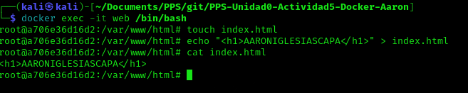

## Ejercicio entregar

### Servidor web
1. Arranca un contenedor que ejecute una instancia de la imagen php:7.4-apache, que se llame web y que sea accesible desde tu equipo en el puerto 8000.


2. Colocar en el directorio raíz del servicio web (/var/www/html) de dicho contenedor un fichero llamado index.html con el siguiente contenido: ```html<h1>HOLA SOY AARONIGLESIASCAPA</h1>```



3. Colocar en este mismo directorio raíz un archivo llamado **index.php** con el siguiente contenido *<?php echo phpinfo() ?>*


### Servidor de base de datos
1. Arrancar un contenedor que se llame bbdd y que ejecute una instancia de la imagen mariadb para que sea accesible desde el puerto 3336.
2. Antes de arrancarlo visitar la página del contenedor en Docker Hub y establecer las variables de entorno necesarias para que:
La contraseña de root sea root.
Crear una base de datos automáticamente al arrancar que se llame prueba.
Crear el usuario invitado con las contraseña invitado.


### Entrega
1. Pantallazo que desde el navegador muestre el fichero index.html.


2. Pantallazo que desde el navegador muestre el fichero index.php.


3. Pantallazo donde se vea el tamaño del contenedor web después de crear los dos ficheros.


4. Pantallazo donde desde un cliente de base de datos (instalado en tu ordenador) se pueda observar que hemos podido conectarnos al servidor de base de datos con el usuario creado y que se ha creado la base de datos prueba (show databases). El acceso se debe realizar desde el ordenador que tenéis instalado docker, no hay que acceder desde dentro del contenedor, es decir, no usar docker exec.


5. Pantallazo donde se comprueba que no se puede borrar la imagen mariadb mientras el contenedor bbdd está creado.


