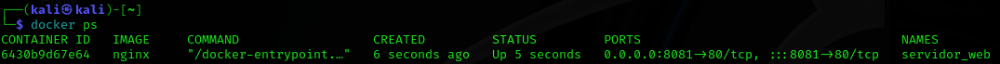

# PPS-Unidad0-Actividad5-Docker-Aaron

## Entregar
Crea un contenedor demonio con un servidor nginx, usando la imagen oficial de nginx. Al crear el contenedor, ¿has tenido que indicar algún comando para que lo ejecute? Accede al navegador web y comprueba que el servidor esta funcionando. Muestra los logs del contenedor.

Vamos a entregar el ejercicio 4 con algunas modificaciones. Crearemos un contenedor demonio a partir de la imagen nginx, el contenedor se debe llamar servidor_web y se debe acceder a él utilizando el puerto 8181 del ordenador donde tengas instalado docker.

Entrega un fichero comprimido o un documento pdf con los siguientes pantallazos:

1. Pantallazo donde se vea la creación del contenedor y podamos comprobar que el contenedor está funcionando.

2. Pantallazo donde se vea el acceso al servidor web utilizando un navegador web (recuerda que tienes que acceder a la ip del ordenador donde tengas instalado docker)

3. Pantallazo donde se vean las imágenes que tienes en tu registro local.

4. Pantallazo donde se vea como se elimina el contenedor (recuerda que antes debe estar parado el contenedor).

