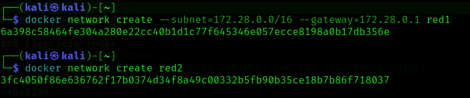
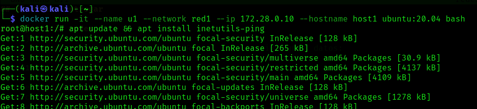
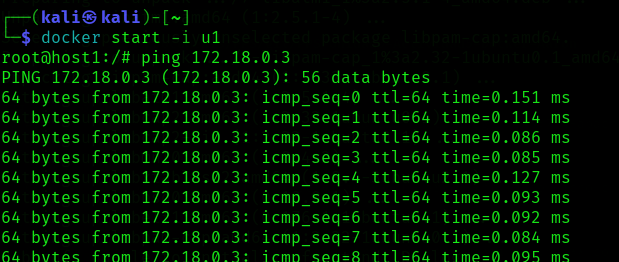

## Ejercicio entregar

### Ejercicio redes
Trabajar con redes docker
Vamos a crear dos redes de ese tipo (BRIDGE) con los siguientes datos:

**Red1**

Nombre: red1
Dirección de red: 172.28.0.0
Máscara de red: 255.255.0.0
Gateway: 172.28.0.1

**Red2**

Nombre: red2
Es resto de los datos será proporcionados automáticamente por Docker.
Poner en ejecución un contenedor de la imagen ubuntu:20.04 que tenga como hostname host1, como IP 172.28.0.10 y que esté conectado a la red1. Lo llamaremos u1.
Entrar en ese contenedor e instalar la aplicación ping (apt update && apt install inetutils-ping).
Poner en ejecución un contenedor de la imagen ubuntu:20.04 que tenga como hostname host2 y que esté conectado a la red2. En este caso será docker el que le de una IP correspondiente a esa red. Lo llamaremos u2.
Entrar en ese contenedor e instalar la aplicación ping (apt update && apt install inetutils-ping).
Deberás entregar los siguientes pantallazos comprimidos en un zip o en un documento pdf:



1. Pantallazo donde se vea la configuración de red del contenedor u1.



2. Pantallazo donde se vea la configuración de red del contenedor u2.


3. Pantallazo donde desde cualquiera de los dos contenedores se pueda ver que no podemos hacer ping al otro ni por ip ni por nombre.


Para que pueda hacerse ping he tenido que conectar el contenedo **u1** a la red **red2** de la siguiente forma.

```bash
docker network disconnect red1 u1
docker network connect red2 u1
```

4. Pantallazo donde se pueda comprobar que si conectamos el contenedor u1 a la red2 (con docker network connect), desde el contenedor u1, tenemos acceso al contenedor u2 mediante ping, tanto por nombre como por ip.



Para saber la ip de alguno de las dos máquinas he intalado el paquete necesario para hacer *ip a**

```bash
apt update && apt install iproute2 -y
```
